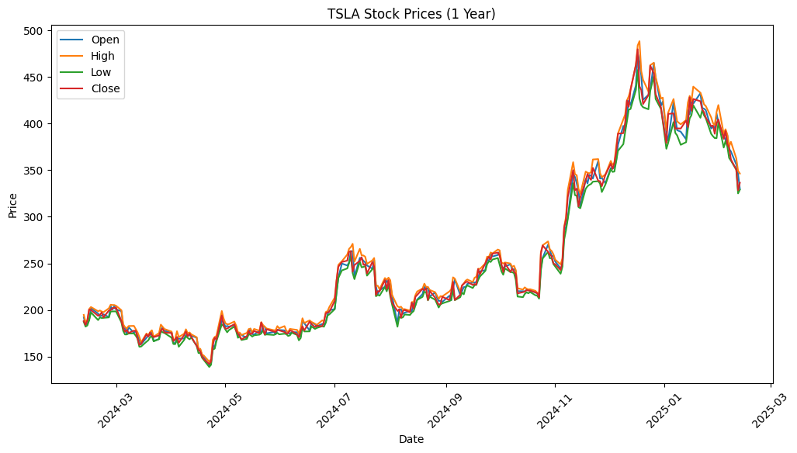
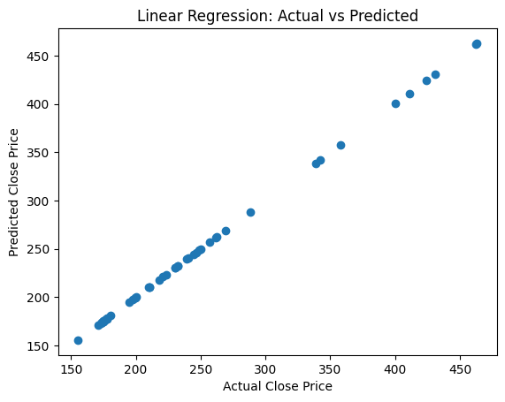
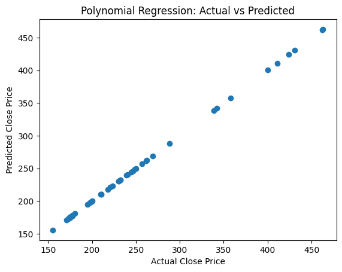
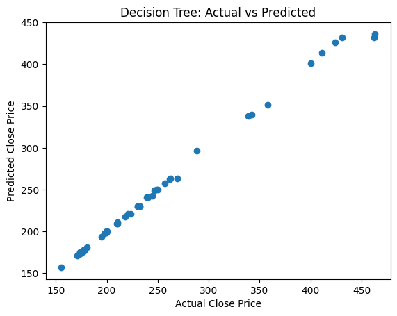
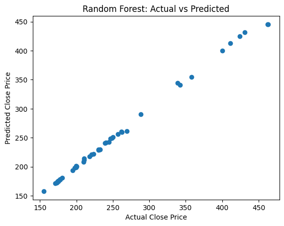

# 📈 Stock Price Prediction with Regression Models

> Predicting Tesla's closing price with four regression algorithms — and catching a textbook case of feature leakage along the way.


## Overview

This project compares four regression techniques — Linear, Polynomial, Decision Tree, and Random Forest — on a year of Tesla (TSLA) stock data to predict the daily closing price. The goal wasn't just to train models and report a score; it was to understand *why* the results looked the way they did, including a deliberate look at a leakage problem that's easy to miss and worth catching.

## Dataset

`TSLA.csv` contains daily OHLCV (Open, High, Low, Close, Adjusted Close, Volume) data for Tesla stock, filtered down to the most recent 12 months.



## Approach

1. Loaded the data and filtered it to the last 12 months
2. Selected `Open`, `High`, `Low`, `Adjusted Close`, and `Volume` as features to predict `Close`
3. Split the data 80/20 into train and test sets
4. Scaled features with `StandardScaler` for the linear-based models
5. Trained four regression models and plotted predictions against actual values
6. Evaluated every model with R² and RMSE

## Models Compared

| Model | What it does |
|---|---|
| Linear Regression | Assumes a straight-line relationship between features and price |
| Polynomial Regression (degree 2) | Captures curved, non-linear relationships |
| Decision Tree Regression | Learns price-splitting rules directly from the data |
| Random Forest Regression | Averages many decision trees to reduce overfitting |

## Results

| Model | R² Score | RMSE |
|---|---|---|
| Linear Regression | 1.0000 | 0.00 |
| Polynomial Regression | 1.0000 | 0.00 |
| Decision Tree | 0.9946 | 6.05 |
| **Random Forest** | **0.9978** | **3.89** |

<table>
<tr>
<td></td>
<td></td>
</tr>
<tr>
<td></td>
<td></td>
</tr>
</table>

## ⚠️ The Catch: Feature Leakage

A perfect R² score should raise an eyebrow, not get celebrated. `Open`, `High`, `Low`, and `Adjusted Close` are all same-day prices that already sit extremely close to the closing price, so Linear and Polynomial Regression aren't really *forecasting* anything here, they're interpolating numbers that already encode most of the answer. Decision Tree and Random Forest score slightly lower precisely because they aren't exploiting that same-day correlation as directly.

Building the models was the easy part. Catching why the results looked too good to be true was the actual lesson, and it's the one that's worth bringing up in an interview.

## Tech Stack

Python, Pandas, NumPy, scikit-learn, Matplotlib, Google Colab

## Project Structure

```
stock_price_prediction/
├── README.md
├── stock_price_prediction_assets/            # plots used in this README
│   ├── tsla_price_trend.png
│   ├── linear_regression_actual_vs_predicted.png
│   ├── polynomial_regression_actual_vs_predicted.png
│   ├── decision_tree_actual_vs_predicted.png
│   └── random_forest_actual_vs_predicted.png
└── PythonProject/
    ├── stock_prediction.ipynb               # full analysis notebook
    ├── TSLA.csv                              # historical TSLA OHLCV data
    ├── Project Overview.pptx                 # project summary slides
    └── StockPricePrediction_Ramya.pptx       # presentation deck
```

## Running it Yourself

```bash
git clone https://github.com/ramyasankar22/stock_price_prediction.git
cd stock_price_prediction/PythonProject
pip install pandas numpy scikit-learn matplotlib
jupyter notebook stock_prediction.ipynb
```

## Future Improvements

- Predict using only *lagged* (previous-day) features to simulate genuine forecasting instead of same-day leakage
- Compare against time-series-specific models like ARIMA or LSTM
- Use walk-forward validation instead of a single train/test split
- Wrap the best-performing model in a small Streamlit app for interactive predictions

---
Built by [Ramya Sankar](https://github.com/ramyasankar22)
